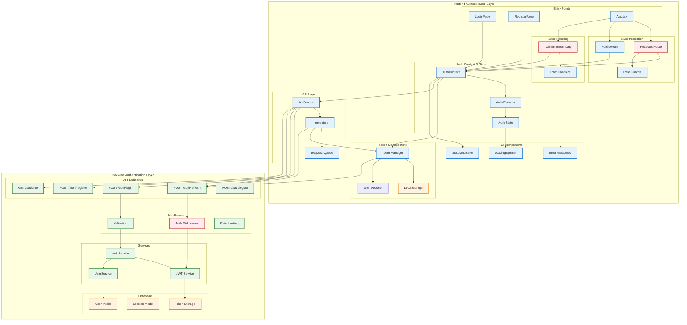
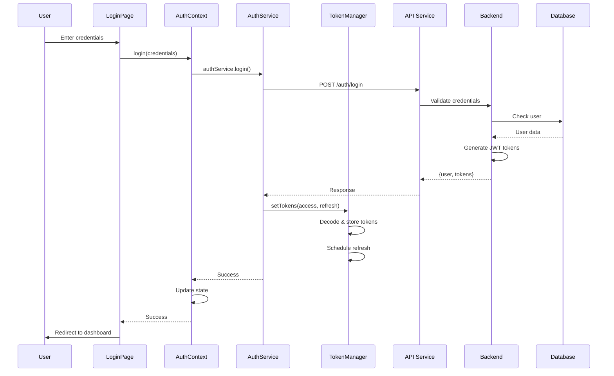
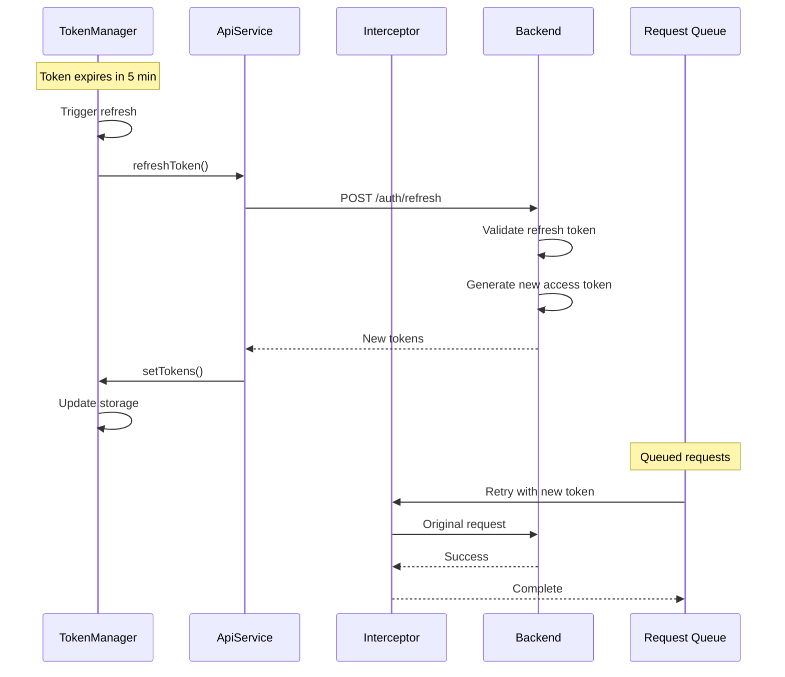
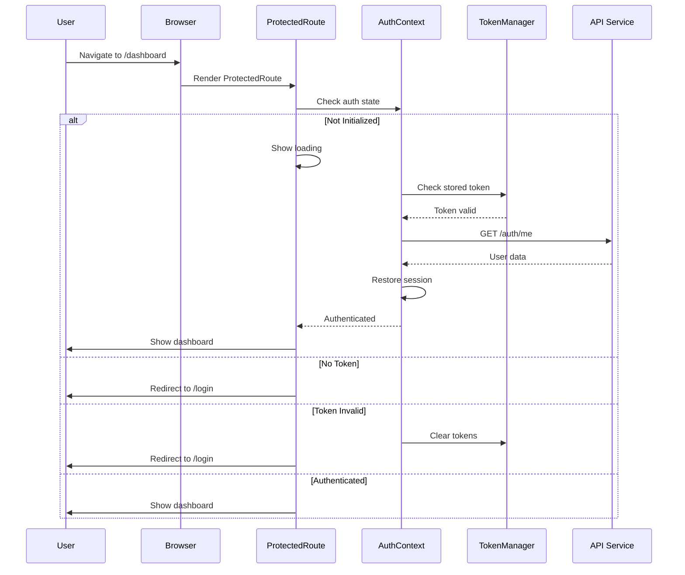
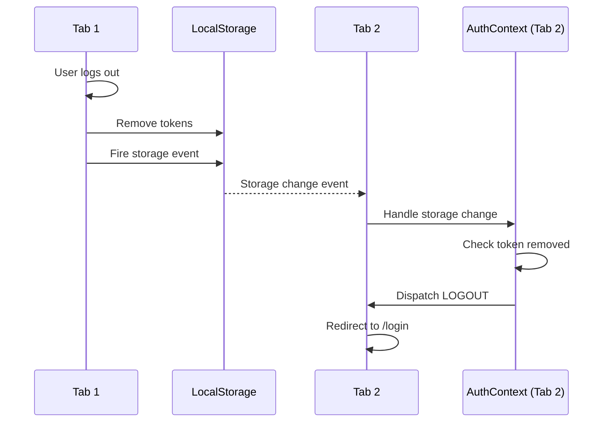
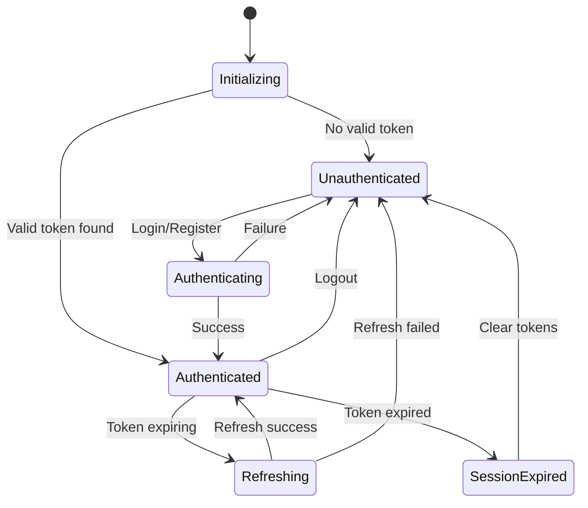

# Authentication System Architecture

## Overview

The authentication system provides secure, token-based authentication with automatic refresh, cross-tab synchronization, and comprehensive error handling. Built with JWT tokens, it supports role-based access control (RBAC) for Student, Teacher, and Admin users.

## Architecture Diagram



## Component Architecture

### 1. Frontend Components

#### Core Authentication Components

```typescript
// Token Manager - Centralized token operations
class TokenManager {
  - setTokens(access: string, refresh: string): boolean
  - getAccessToken(): string | null
  - getRefreshToken(): string | null
  - isTokenValid(): boolean
  - shouldRefreshToken(): boolean
  - clearTokens(): void
  - scheduleTokenRefresh(): void
  - decodeJWT(token: string): JWTPayload
}

// Auth Context - State management
interface AuthState {
  user: User | null
  isAuthenticated: boolean
  isLoading: boolean
  isInitialized: boolean
  error: string | null
}

// Protected Route - Access control
interface ProtectedRouteProps {
  children: ReactNode
  requiredRole?: 'STUDENT' | 'TEACHER' | 'ADMIN'
  fallback?: ReactNode
  redirectTo?: string
}
```

#### Component Hierarchy

```text
App.tsx
├── AuthProvider
│   ├── AuthErrorBoundary
│   │   ├── Router
│   │   │   ├── PublicRoute
│   │   │   │   ├── LoginPage
│   │   │   │   └── RegisterPage
│   │   │   └── ProtectedRoute
│   │   │       ├── Layout
│   │   │       │   ├── Header (with AuthBadge)
│   │   │       │   ├── Sidebar
│   │   │       │   └── Content
│   │   │       │       ├── DashboardPage
│   │   │       │       ├── LessonsPage
│   │   │       │       └── [Other Protected Pages]
│   │   │       └── AuthStatusIndicator
│   │   └── VideoStateProvider
│   └── TokenRefreshListener
└── StorageSyncListener
```

### 2. Backend Components

#### API Structure

```typescript
// Auth Routes
router.post('/auth/login', validateLogin, authController.login)
router.post('/auth/register', validateRegister, authController.register)
router.post('/auth/refresh', authController.refreshToken)
router.get('/auth/me', authenticate, authController.getCurrentUser)
router.post('/auth/logout', authenticate, authController.logout)

// Middleware Stack
app.use(rateLimiter)
app.use(bodyParser)
app.use(cors)
app.use(authenticate) // JWT validation
app.use(authorize)    // Role checking
```

## Authentication Flows

### 1. Login Flow



### 2. Token Refresh Flow



### 3. Protected Route Access Flow



### 4. Cross-Tab Synchronization Flow



## State Management

### Auth State Machine



### Redux-like State Actions

```typescript
type AuthAction =
  | { type: 'LOGIN_START' }
  | { type: 'LOGIN_SUCCESS'; payload: User }
  | { type: 'LOGIN_ERROR'; payload: string }
  | { type: 'LOGOUT' }
  | { type: 'RESTORE_SESSION'; payload: User }
  | { type: 'SESSION_EXPIRED' }
  | { type: 'REFRESH_START' }
  | { type: 'REFRESH_SUCCESS'; payload: User }
  | { type: 'REFRESH_ERROR' }
  | { type: 'INITIALIZED' }
```

## Security Architecture

### Token Security

```yaml
Access Token:
  - Lifetime: 15 minutes
  - Storage: Memory + localStorage
  - Usage: API authentication
  - Refresh: Automatic before expiry

Refresh Token:
  - Lifetime: 7 days
  - Storage: httpOnly cookie (production) / localStorage (dev)
  - Usage: Get new access token
  - Rotation: New refresh token on use

Security Headers:
  - Authorization: Bearer <token>
  - X-CSRF-Token: CSRF protection
  - X-Request-ID: Request tracking
```

### Role-Based Access Control (RBAC)

```typescript
// Role Hierarchy
enum UserRole {
  ADMIN = 'ADMIN',       // Full system access
  TEACHER = 'TEACHER',   // Content creation, student management
  STUDENT = 'STUDENT'    // Content consumption, learning
}

// Permission Matrix
const permissions = {
  ADMIN: ['*'],
  TEACHER: [
    'lessons.create',
    'lessons.update',
    'lessons.delete',
    'students.view',
    'analytics.view'
  ],
  STUDENT: [
    'lessons.view',
    'lessons.enroll',
    'progress.update',
    'profile.update'
  ]
}
```

### Security Measures

1. **Token Validation**
   - JWT signature verification
   - Expiry checking
   - Issuer/Audience validation

2. **Request Security**
   - CORS configuration
   - Rate limiting
   - Request sanitization
   - SQL injection prevention

3. **Error Handling**
   - No sensitive data in errors
   - Generic error messages
   - Detailed logging server-side

4. **Session Security**
   - Automatic logout on inactivity
   - Token refresh rotation
   - Cross-tab logout sync

## Error Handling Architecture

### Error Boundary Hierarchy

```text
AuthErrorBoundary (Top Level)
├── Catches all auth-related errors
├── Clears invalid tokens
├── Redirects to login
└── Shows user-friendly messages

Component Error Boundaries
├── API call failures
├── Network errors
├── Validation errors
└── Unexpected errors
```

### Error Types and Handling

```typescript
// Error Classifications
enum AuthErrorType {
  INVALID_CREDENTIALS = 'INVALID_CREDENTIALS',
  TOKEN_EXPIRED = 'TOKEN_EXPIRED',
  TOKEN_INVALID = 'TOKEN_INVALID',
  NETWORK_ERROR = 'NETWORK_ERROR',
  PERMISSION_DENIED = 'PERMISSION_DENIED',
  SESSION_EXPIRED = 'SESSION_EXPIRED',
  RATE_LIMITED = 'RATE_LIMITED'
}

// Error Handlers
const errorHandlers = {
  [AuthErrorType.INVALID_CREDENTIALS]: () => {
    showToast('Invalid email or password')
  },
  [AuthErrorType.TOKEN_EXPIRED]: () => {
    dispatch({ type: 'SESSION_EXPIRED' })
    redirect('/login')
  },
  [AuthErrorType.PERMISSION_DENIED]: () => {
    showToast('You don\'t have permission')
    redirect('/dashboard')
  }
}
```

## Performance Optimizations

### 1. Request Optimization

```typescript
// Request Deduplication
class RequestQueue {
  private pending: Map<string, Promise<any>>
  
  async execute(key: string, request: () => Promise<any>) {
    if (this.pending.has(key)) {
      return this.pending.get(key)
    }
    
    const promise = request()
    this.pending.set(key, promise)
    
    try {
      const result = await promise
      return result
    } finally {
      this.pending.delete(key)
    }
  }
}
```

### 2. Token Refresh Optimization

- **Proactive Refresh**: Refresh 5 minutes before expiry
- **Request Queuing**: Queue requests during refresh
- **Single Refresh**: Deduplicate concurrent refresh attempts
- **Background Refresh**: Non-blocking token refresh

### 3. Storage Optimization

- **Selective Storage**: Only store essential data
- **Compression**: Compress large payloads
- **Cleanup**: Remove expired data automatically
- **Indexing**: Use indexed keys for fast retrieval

## Monitoring & Analytics

### Auth Metrics

```typescript
// Track authentication events
interface AuthMetrics {
  loginAttempts: number
  loginSuccesses: number
  loginFailures: number
  tokenRefreshes: number
  sessionDurations: number[]
  errorRates: Map<string, number>
}

// Analytics Events
trackEvent('auth.login.success', { userId, role })
trackEvent('auth.token.refresh', { userId })
trackEvent('auth.session.expired', { userId, duration })
trackEvent('auth.error', { type, userId })
```

### Health Checks

```typescript
// Auth system health check
GET /health/auth
{
  "status": "healthy",
  "checks": {
    "database": "connected",
    "redis": "connected",
    "jwt": "valid",
    "rateLimit": "ok"
  },
  "metrics": {
    "activeUsers": 1234,
    "avgSessionDuration": 3600,
    "tokenRefreshRate": 0.85
  }
}
```

## Testing Strategy

### Unit Tests

```typescript
describe('TokenManager', () => {
  test('should validate token expiry', () => {
    const expired = createExpiredToken()
    expect(TokenManager.isTokenValid(expired)).toBe(false)
  })
  
  test('should schedule refresh correctly', () => {
    const token = createTokenExpiringIn(10 * 60 * 1000)
    TokenManager.setTokens(token, refresh)
    expect(TokenManager.shouldRefreshToken()).toBe(true)
  })
})
```

### Integration Tests

```typescript
describe('Auth Flow', () => {
  test('complete login flow', async () => {
    // Login
    await userEvent.type(emailInput, 'test@example.com')
    await userEvent.type(passwordInput, 'password')
    await userEvent.click(loginButton)
    
    // Verify redirect
    await waitFor(() => {
      expect(window.location.pathname).toBe('/dashboard')
    })
    
    // Verify token stored
    expect(TokenManager.isTokenValid()).toBe(true)
  })
})
```

### E2E Tests

```typescript
describe('Auth E2E', () => {
  test('cross-tab logout', async () => {
    // Login in tab 1
    const tab1 = await browser.newPage()
    await tab1.goto('/login')
    await login(tab1)
    
    // Open tab 2
    const tab2 = await browser.newPage()
    await tab2.goto('/dashboard')
    
    // Logout in tab 1
    await logout(tab1)
    
    // Verify tab 2 redirected
    await tab2.waitForNavigation()
    expect(tab2.url()).toContain('/login')
  })
})
```

## Migration Guide

### From Session-Based to Token-Based Auth

```typescript
// Old (Session-based)
app.use(session({
  secret: 'secret',
  cookie: { maxAge: 3600000 }
}))

// New (Token-based)
app.use(authenticate) // JWT middleware

// Migration steps:
1. Deploy token auth alongside sessions
2. Migrate users gradually
3. Monitor both systems
4. Deprecate sessions
5. Remove session code
```

## Best Practices

### Do's ✅

1. **Always use TokenManager** for token operations
2. **Wrap routes** with ProtectedRoute/PublicRoute
3. **Handle errors** at appropriate levels
4. **Log security events** for auditing
5. **Refresh tokens** proactively
6. **Clear tokens** on logout
7. **Validate roles** on frontend AND backend
8. **Use HTTPS** in production

### Don'ts ❌

1. **Don't store** sensitive data in localStorage
2. **Don't expose** tokens in URLs
3. **Don't trust** frontend validation alone
4. **Don't ignore** token expiry
5. **Don't hardcode** token lifetimes
6. **Don't skip** error boundaries
7. **Don't forget** cross-tab sync
8. **Don't log** tokens or passwords

## Troubleshooting Guide

### Common Issues

| Issue | Symptoms | Solution |
|-------|----------|----------|
| Infinite redirect loop | Login → Dashboard → Login | Check TokenManager.isTokenValid() |
| 401 after login | API calls fail immediately | Verify token in Authorization header |
| Lost auth on refresh | Logged out on page reload | Check localStorage persistence |
| Cross-tab sync fails | Logout doesn't affect other tabs | Verify storage event listeners |
| Token not refreshing | Session expires unexpectedly | Check refresh timer logic |
| Role check fails | Can't access authorized pages | Verify user.role matches requirement |

## Future Enhancements

1. **Multi-Factor Authentication (MFA)**
   - SMS/Email verification
   - Authenticator app support
   - Backup codes

2. **Single Sign-On (SSO)**
   - OAuth2 providers
   - SAML integration
   - Social login

3. **Advanced Security**
   - Device fingerprinting
   - Anomaly detection
   - IP allowlisting
   - Geolocation checks

4. **Session Management**
   - Active session list
   - Remote logout
   - Session hijacking prevention
   - Remember me functionality

5. **Audit & Compliance**
   - Detailed audit logs
   - GDPR compliance
   - Data retention policies
   - Security certifications
