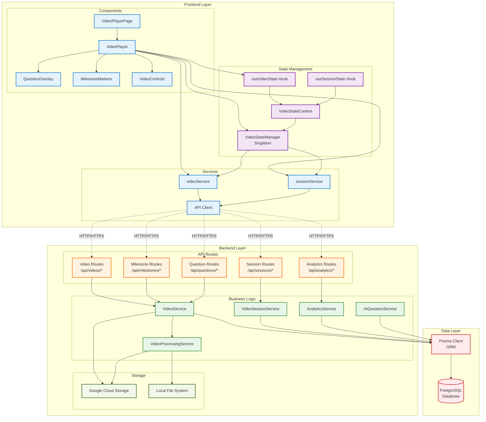
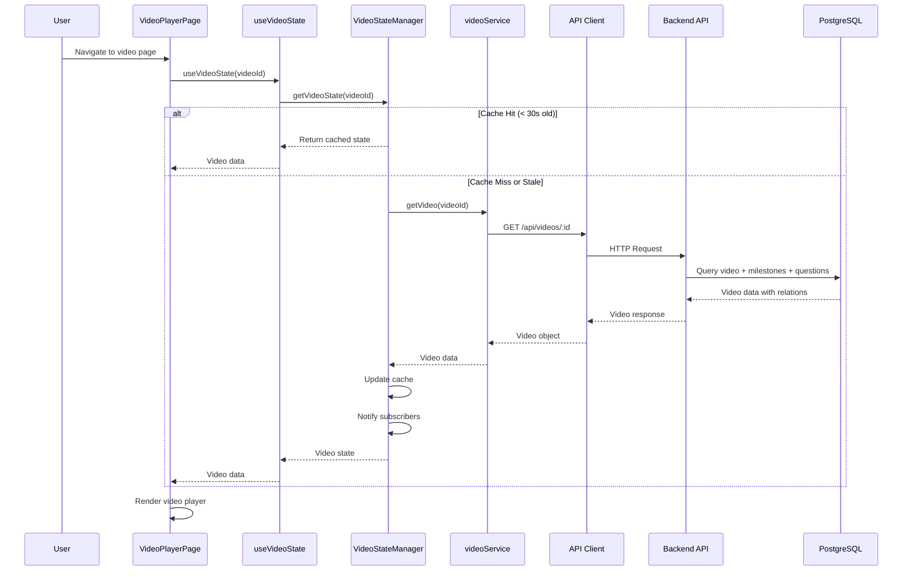
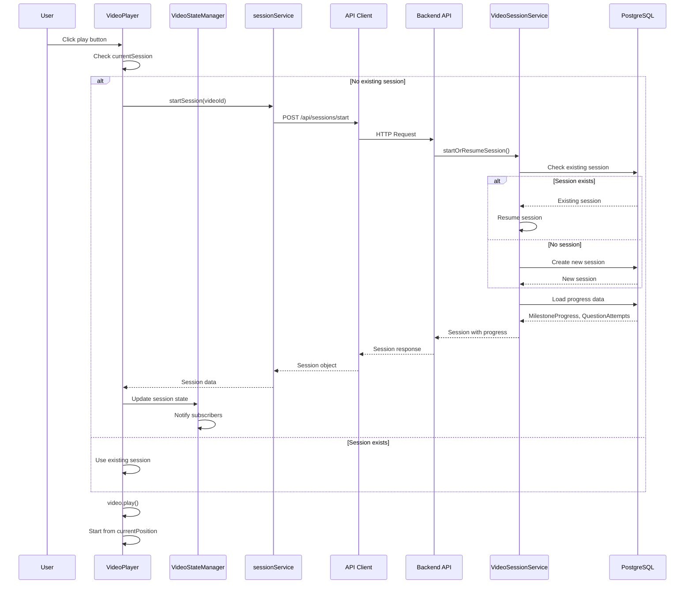
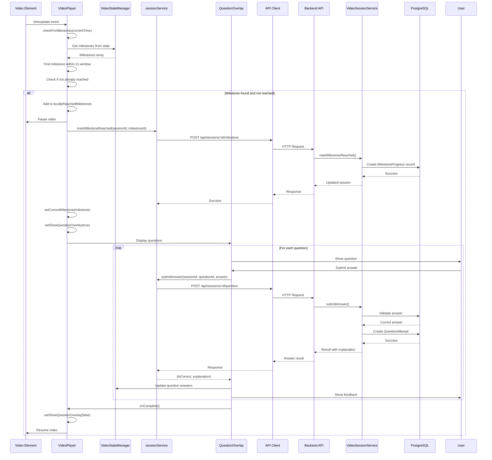
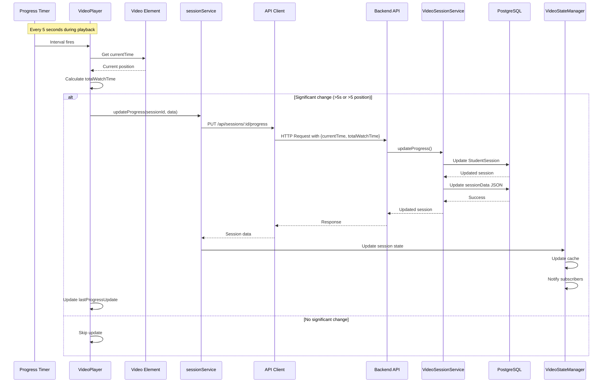
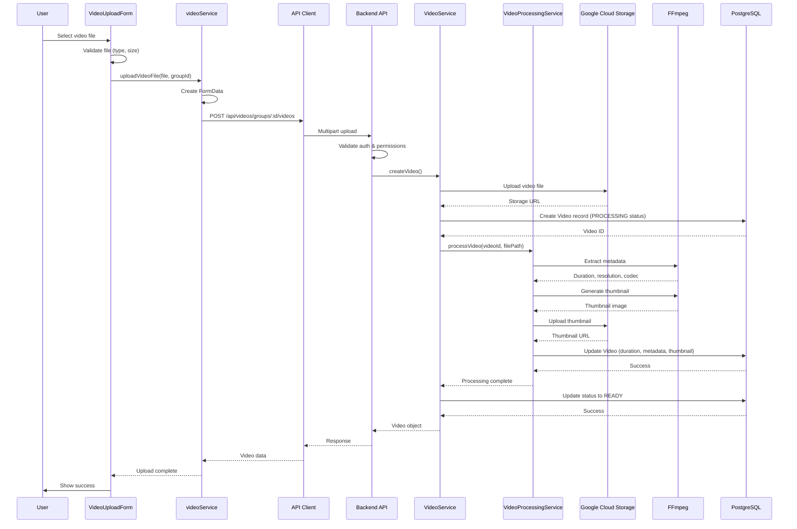
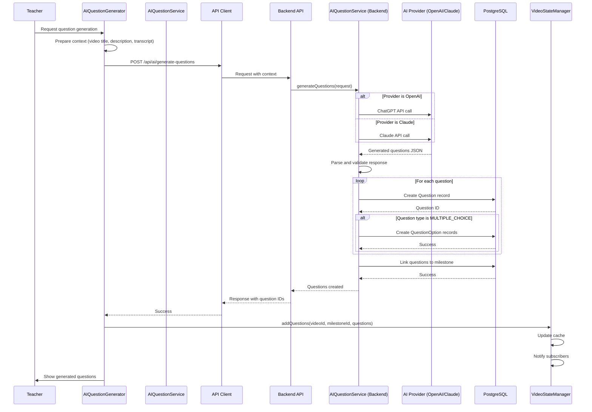
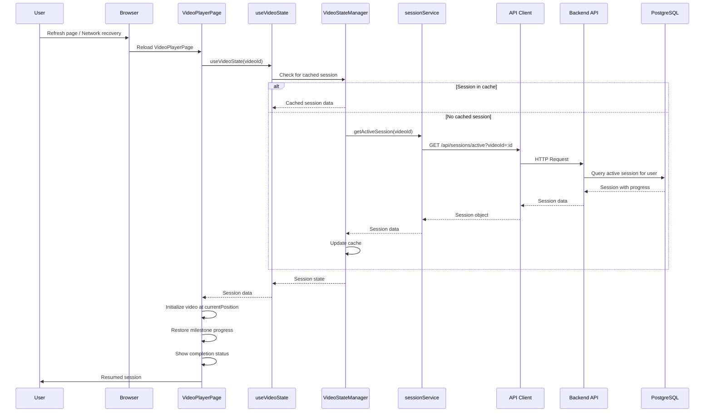

# Video Player System Architecture v2

## Overview

The Interactive Learning Platform's video player system is a sophisticated educational technology stack that provides milestone-based learning experiences with interactive questions, real-time progress tracking, and multi-device session persistence. This document reflects the current implementation as of the latest codebase updates.

## High-Level Architecture



## Core Components

### Frontend Components

#### VideoPlayer (`frontend/src/components/video/VideoPlayer.tsx`)
The main video playback component that orchestrates the entire learning experience.

**Key Responsibilities:**
- Video playback control and state management
- Milestone detection and triggering (within 2-second tolerance)
- Session lifecycle management (start, progress, complete)
- Progress tracking with 5-second update intervals
- Question overlay display coordination

**State Management:**
- Uses `useVideoState` hook for unified video/milestone data
- Maintains local state for playback controls (play, pause, volume, etc.)
- Tracks watch time and session progress
- Manages milestone reached states to prevent duplicate triggers

**Key Features:**
- Automatic session resumption from last position
- Real-time milestone checking during playback
- Pause video automatically when questions appear
- Progress persistence across page refreshes

#### VideoStateManager (`frontend/src/stores/VideoStateManager.ts`)
Centralized singleton state manager for all video-related data.

**Core Functionality:**
- Caches video, milestone, and question data
- Manages session state and progress
- Provides subscription-based state updates
- Handles optimistic updates for better UX

**Data Structures:**
```typescript
VideoState {
  video: Video
  milestones: Milestone[]
  questions: Map<string, Question[]>
  metadata: {
    totalMilestones: number
    totalQuestions: number
    questionsPerMilestone: Map<string, number>
    lastUpdated: Date
    isLoading: boolean
    error: string | null
  }
}

SessionState {
  session: VideoSession
  milestoneProgress: Set<string>
  questionAnswers: Map<string, QuestionAnswer>
  currentMilestone: Milestone | null
  metadata: {
    correctAnswers: number
    totalAnswers: number
    completionPercentage: number
    lastUpdated: Date
  }
}
```

#### QuestionOverlay (`frontend/src/components/video/QuestionOverlay.tsx`)
Modal component for displaying and handling interactive questions.

**Features:**
- Supports multiple question types (Multiple Choice, True/False, Short Answer)
- Real-time answer validation
- Feedback display with explanations
- Progress tracking within question sets

#### MilestoneMarkers (`frontend/src/components/video/MilestoneMarkers.tsx`)
Visual timeline component showing milestone positions.

**Features:**
- Interactive timeline with clickable markers
- Visual indicators for reached/unreached milestones
- Color coding for different milestone types
- Hover tooltips with milestone details

#### VideoControls (`frontend/src/components/video/VideoControls.tsx`)
Custom video control bar with enhanced features.

**Controls:**
- Play/Pause toggle
- Seekable progress bar
- Volume control with mute
- Fullscreen toggle
- Time display (current/total)
- Playback speed adjustment

### Backend Services

#### VideoService (`src/services/VideoService.ts`)
Core service for video management operations.

**Responsibilities:**
- Video CRUD operations with multi-tenant support
- Integration with storage services (GCS/local)
- Metadata extraction via VideoProcessingService
- Access control and enrollment verification
- Streaming URL generation with authentication

#### VideoSessionService (`src/services/VideoSessionService.ts`)
Manages student learning sessions and progress tracking.

**Key Functions:**
- Session creation and resumption logic
- Progress tracking with automatic save
- Milestone achievement recording
- Question answer validation and scoring
- Session completion with metrics calculation

**Session Lifecycle:**
1. **Start/Resume**: Creates new or retrieves existing session
2. **Progress Update**: Saves position and watch time periodically
3. **Milestone Reached**: Records achievement with timestamp
4. **Question Submit**: Validates answers and updates scores
5. **Complete**: Finalizes session with completion metrics

#### AIQuestionService (`src/services/AIQuestionService.ts`)
AI-powered question generation service.

**Features:**
- Multi-provider support (OpenAI, Claude)
- Context-aware question generation
- Multiple question type generation
- Difficulty level customization
- Batch question creation for milestones

#### VideoProcessingService (`src/services/VideoProcessingService.ts`)
Handles video file processing and metadata extraction.

**Processing Pipeline:**
1. Upload validation (format, size)
2. Metadata extraction (FFprobe)
3. Thumbnail generation (FFmpeg)
4. Duration calculation
5. Database update with metadata

### Data Models

#### Core Video Models
```prisma
Video {
  id: String
  title: String
  description: String?
  videoGroupId: String
  uploadedBy: String
  uploadedAt: DateTime
  processedAt: DateTime?
  status: VideoStatus
  duration: Float?
  metadata: Json?
  storageUrl: String
  thumbnailUrl: String?
  milestones: Milestone[]
  studentSessions: StudentSession[]
}

Milestone {
  id: String
  videoId: String
  timestamp: Float
  type: MilestoneType
  title: String
  description: String?
  order: Int
  isRequired: Boolean
  retryLimit: Int
  questions: Question[]
}

Question {
  id: String
  milestoneId: String
  type: QuestionType
  text: String
  questionData: Json
  explanation: String?
  createdById: String
  options: QuestionOption[]
}
```

#### Progress Tracking Models
```prisma
StudentSession {
  id: String
  studentId: String
  videoId: String
  status: SessionStatus
  currentPosition: Float
  totalWatchTime: Float
  completedMilestones: String[]
  sessionData: Json?
  startedAt: DateTime
  completedAt: DateTime?
  lastSeenAt: DateTime
  milestoneProgress: MilestoneProgress[]
  questionAttempts: QuestionAttempt[]
}

MilestoneProgress {
  id: String
  sessionId: String
  milestoneId: String
  reachedAt: DateTime
  attemptNumber: Int
}

QuestionAttempt {
  id: String
  sessionId: String
  questionId: String
  milestoneId: String
  studentAnswer: String
  isCorrect: Boolean?
  score: Float?
  feedback: String?
  attemptedAt: DateTime
}
```

## Data Flow Patterns

### 1. Video Loading with State Management



### 2. Session Management Flow



### 3. Milestone Detection and Question Flow



### 4. Progress Tracking Flow



### 5. Video Upload and Processing Flow



### 6. AI Question Generation Flow



### 7. Session Recovery Flow



## Key Features Implementation

### Milestone Tolerance System
- Milestones trigger within a 2-second window of their timestamp
- Prevents duplicate triggers using local and server tracking
- Immediately adds to local state to prevent re-triggering

### Session Persistence
- Sessions saved to database with current position
- Automatic resumption on page reload
- Cross-device continuation support
- Session recovery after network failures

### Progress Calculation
- Real-time completion percentage
- Watch time tracking (actual time watched, not video duration)
- Milestone achievement tracking
- Question answer statistics

### State Synchronization
- VideoStateManager acts as single source of truth
- Subscription-based updates for reactive UI
- Optimistic updates for better perceived performance
- Cache invalidation after 30 seconds

## Performance Optimizations

### Frontend
1. **Debounced Progress Updates**: Updates sent every 5 seconds
2. **State Caching**: 30-second cache for video data
3. **Lazy Loading**: Components loaded on demand
4. **Optimistic UI Updates**: Immediate local state updates

### Backend
1. **Database Indexing**: Optimized queries on frequently accessed fields
2. **Streaming Responses**: Video served with range requests
3. **Connection Pooling**: Prisma connection management
4. **Query Optimization**: Selective field loading with Prisma select

## Security Measures

### Authentication & Authorization
- JWT-based authentication for all API calls
- Role-based access control (Student, Teacher, Admin)
- Enrollment verification for video access
- Token refresh mechanism for long sessions

### Data Protection
- Input validation on all endpoints
- SQL injection prevention via Prisma parameterized queries
- XSS protection through React's automatic escaping
- CORS configuration for API security

### Video Security
- Signed URLs for video streaming
- Access token validation on stream requests
- Rate limiting on API endpoints
- File upload validation and sanitization

## Error Handling Strategy

### Frontend Error Recovery
- Network failure retry with exponential backoff
- Graceful degradation for missing features
- User-friendly error messages
- Automatic session recovery

### Backend Error Handling
- Structured error responses with error codes
- Detailed logging for debugging
- Transaction rollback on failures
- Circuit breaker pattern for external services

## Testing Considerations

### Unit Testing
- Component testing with React Testing Library
- Service layer testing with mocked dependencies
- State manager testing with various scenarios

### Integration Testing
- API endpoint testing with supertest
- Database integration tests with test database
- Video processing pipeline testing

### E2E Testing
- Full user journey testing
- Cross-browser compatibility
- Mobile responsiveness
- Performance testing under load

## Future Enhancements

### Planned Features
1. **Adaptive Bitrate Streaming**: Quality adjustment based on bandwidth
2. **Offline Mode**: Download videos for offline viewing
3. **Collaborative Features**: Shared watching sessions
4. **Advanced Analytics**: Detailed learning analytics dashboard
5. **AI-Powered Recommendations**: Personalized learning paths

### Technical Improvements
1. **WebSocket Integration**: Real-time progress sync
2. **CDN Integration**: Global video delivery
3. **Microservices Architecture**: Service decomposition
4. **GraphQL API**: More efficient data fetching
5. **Server-Side Rendering**: Improved SEO and performance

## Deployment Considerations

### Infrastructure Requirements
- Node.js 18+ for backend
- PostgreSQL 14+ for database
- Redis for session caching (optional)
- FFmpeg for video processing
- Google Cloud Storage for video storage

### Scaling Strategy
- Horizontal scaling for API servers
- Read replicas for database
- CDN for static assets and videos
- Queue system for video processing
- Load balancing with health checks

## Monitoring & Observability

### Metrics to Track
- Video loading times
- Session creation success rate
- Question answer submission latency
- Progress update frequency
- Error rates by endpoint

### Logging Strategy
- Structured logging with correlation IDs
- Error tracking with stack traces
- Performance metrics logging
- User action audit trail
- Security event logging

## Conclusion

The video player system architecture provides a robust foundation for interactive video-based learning. The combination of real-time state management, milestone-based interactions, and comprehensive progress tracking creates an engaging educational experience. The modular design allows for easy extension and maintenance while maintaining high performance and reliability standards.