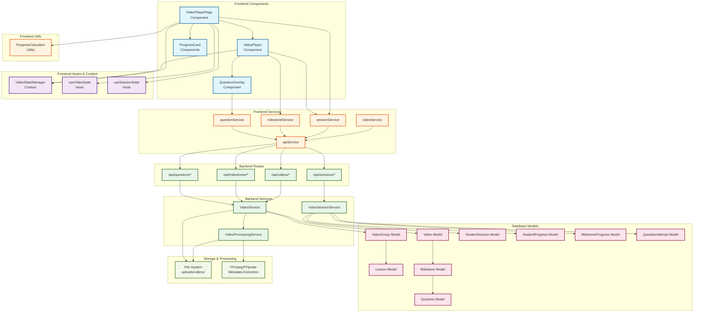

# Video Player System Architecture

## Structural Diagram



## Component Descriptions

### Frontend Layer

#### Components
- **VideoPlayerPage** (`/frontend/src/pages/video/VideoPlayerPage.tsx`)
  - Main container component for the video learning experience
  - Manages overall page state and orchestrates child components
  - Handles session initialization and completion

- **VideoPlayer** (`/frontend/src/components/video/VideoPlayer.tsx`)
  - Core video playback component
  - Detects milestone triggers based on video timestamp
  - Manages play/pause states and progress tracking
  - Communicates with VideoStateManager for state updates

- **QuestionOverlay** (`/frontend/src/components/video/QuestionOverlay.tsx`)
  - Modal overlay displayed when milestone questions are triggered
  - Handles different question types (Multiple Choice, True/False, Short Answer)
  - Submits answers through questionService

- **ProgressCard** Components
  - Display learning metrics in real-time
  - Shows completion percentage, milestones reached, correct answers

#### State Management
- **VideoStateManager** (`/frontend/src/contexts/VideoStateContext.tsx`)
  - Centralized context provider for video and session state
  - Manages state synchronization between components
  - Handles session persistence and recovery

- **useVideoState** (`/frontend/src/hooks/useVideoState.ts`)
  - Custom hook for accessing current video data
  - Provides loading and error states
  - Manages video metadata

- **useSessionState** (`/frontend/src/hooks/useVideoState.ts`)
  - Custom hook for accessing session progress data
  - Tracks milestone progress and question attempts
  - Provides session metadata

#### Services
- **videoService** (`/frontend/src/services/video.ts`)
  - Handles video CRUD operations
  - Manages video upload with progress tracking
  - Generates streaming URLs with authentication

- **sessionService** (`/frontend/src/services/video.ts`)
  - Manages learning session lifecycle (start, update, complete)
  - Tracks progress and milestone achievements
  - Handles question answer submissions

- **milestoneService** (`/frontend/src/services/video.ts`)
  - CRUD operations for video milestones
  - Links questions to milestones

- **questionService** (`/frontend/src/services/video.ts`)
  - Creates and manages questions
  - Handles different question types
  - Processes answer validation

- **ProgressCalculator** (`/frontend/src/utils/progressCalculator.ts`)
  - Utility class for calculating various progress metrics
  - Handles edge cases (null duration, missing data)
  - Provides consistent progress calculations across components

### Backend Layer

#### Routes
- **Video Routes** (`/src/routes/videoRoutes.ts`)
  - `GET /api/videos` - List video groups
  - `POST /api/videos/groups` - Create video group
  - `POST /api/videos/groups/:id/videos` - Upload video
  - `GET /api/videos/:id` - Get video details
  - `GET /api/videos/:id/stream` - Stream video content

- **Session Routes** (`/src/routes/sessionRoutes.ts`)
  - `POST /api/sessions/start` - Start or resume session
  - `PUT /api/sessions/:id/progress` - Update progress
  - `POST /api/sessions/:id/milestone` - Mark milestone reached
  - `POST /api/sessions/:id/question` - Submit answer
  - `PUT /api/sessions/:id/complete` - Complete session

- **Milestone Routes** (`/src/routes/milestoneRoutes.ts`)
  - `GET /api/milestones/video/:videoId` - Get video milestones
  - `POST /api/milestones` - Create milestone
  - `PUT /api/milestones/:id` - Update milestone
  - `DELETE /api/milestones/:id` - Delete milestone

- **Question Routes** (`/src/routes/questionRoutes.ts`)
  - `GET /api/questions/milestone/:id` - Get milestone questions
  - `POST /api/questions` - Create question
  - `PUT /api/questions/:id` - Update question
  - `DELETE /api/questions/:id` - Delete question

#### Services
- **VideoService** (`/src/services/VideoService.ts`)
  - Business logic for video operations
  - Access control and multi-tenant filtering
  - Integration with VideoProcessingService

- **VideoSessionService** (`/src/services/VideoSessionService.ts`)
  - Manages student learning sessions
  - Tracks progress and milestone achievements
  - Handles question answer validation
  - Calculates scores and feedback

- **VideoProcessingService** (`/src/services/VideoProcessingService.ts`)
  - Extracts video metadata using FFmpeg/FFprobe
  - Generates thumbnails
  - Validates video formats
  - Updates database with duration and metadata

### Data Layer

#### Core Models
- **Video** (`/database/prisma/schema.prisma`)
  - Stores video metadata and file paths
  - Links to VideoGroup and Milestones
  - Tracks processing status

- **VideoGroup** 
  - Collection of related videos
  - Belongs to a Lesson
  - Maintains video ordering

- **Lesson**
  - Educational content container
  - Contains VideoGroups
  - Tracks student enrollment

- **Milestone**
  - Pause points in videos
  - Types: PAUSE, QUIZ, CHECKPOINT
  - Contains Questions

- **Question**
  - Different types: MULTIPLE_CHOICE, TRUE_FALSE, SHORT_ANSWER, FILL_IN_BLANK
  - Stores question data in flexible JSON format
  - Links to Milestone

#### Progress Tracking Models
- **StudentSession**
  - Active video viewing session
  - Tracks current position and status
  - Links to milestone progress and question attempts

- **StudentProgress**
  - Overall lesson progress
  - Aggregates completion metrics
  - Tracks time spent

- **MilestoneProgress**
  - Records when milestones are reached
  - Links session to milestone
  - Timestamps achievement

- **QuestionAttempt**
  - Records each answer attempt
  - Stores student answers
  - Tracks correctness and scores
  - Provides feedback

### Storage & Processing

- **File System** (`/uploads/videos/`)
  - Local storage for video files
  - Organized by unique identifiers
  - Separate directories for videos and thumbnails

- **FFmpeg/FFprobe**
  - Extracts video metadata (duration, resolution, codec)
  - Generates thumbnail images
  - Validates video integrity

## Data Flow Examples

### 1. Video Loading Flow
```
VideoPlayerPage → videoService.getVideo() → API → GET /api/videos/:id 
→ VideoService.getVideoById() → Database → Return video with milestones
```

### 2. Session Start Flow
```
VideoPlayer → sessionService.startSession() → API → POST /api/sessions/start
→ VideoSessionService.startSession() → Create/Resume Session → Database
```

### 3. Progress Update Flow
```
VideoPlayer (timeupdate event) → VideoStateManager.updateProgress() 
→ sessionService.updateProgress() → API → PUT /api/sessions/:id/progress
→ VideoSessionService.updateProgress() → Database
```

### 4. Question Answer Flow
```
QuestionOverlay → Submit Answer → questionService.submitAnswer() 
→ API → POST /api/sessions/:id/question
→ VideoSessionService.submitAnswer() → Validate → QuestionAttempt → Database
```

### 5. Video Upload & Processing Flow
```
Upload Form → videoService.uploadVideoFile() → Multipart Upload 
→ POST /api/videos/groups/:id/videos → VideoService.createVideo()
→ VideoProcessingService.getVideoMetadata() → FFprobe → Update Database
```

## Key Features

1. **Milestone-Based Learning**: Videos pause at predefined points for knowledge checks
2. **Progress Persistence**: Sessions are saved and can be resumed across devices
3. **Multi-Question Support**: Various question types with automatic grading
4. **Real-time Progress Tracking**: Live updates of completion percentage and achievements
5. **Video Metadata Extraction**: Automatic duration and thumbnail generation
6. **Access Control**: Role-based access with enrollment verification
7. **Error Recovery**: Graceful handling of network issues and session recovery

## Security Considerations

1. **Authentication**: JWT-based authentication for all API calls
2. **Authorization**: Role-based access control (Student, Teacher, Admin)
3. **Enrollment Verification**: Students must be enrolled to access lesson videos
4. **Secure Streaming**: Token-based video streaming with access validation
5. **Input Validation**: Server-side validation for all user inputs
6. **SQL Injection Prevention**: Parameterized queries via Prisma ORM

## Performance Optimizations

1. **Video Streaming**: Range-based requests for efficient bandwidth usage
2. **Progress Debouncing**: Batched progress updates to reduce API calls
3. **Lazy Loading**: Components and data loaded on demand
4. **Caching**: Session data cached in context to reduce fetches
5. **Database Indexing**: Optimized queries with proper indexes

## Error Handling

1. **Network Failures**: Retry logic with exponential backoff
2. **Session Recovery**: Automatic session restoration on page reload
3. **Video Loading Errors**: Fallback UI with retry options
4. **Invalid Questions**: Graceful degradation for malformed question data
5. **Access Denied**: Clear messaging for enrollment requirements